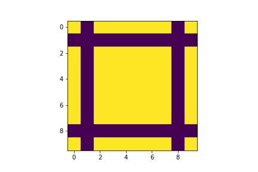

# exercices semaine 1

ouvrez ce document dans vs-code, et visualisez la version "rendue", ce sera plus facile à lire

## sujets traités

* les tableaux
* la mémoire
* vectorisation
* indexation et slicing

## modalités

* créez un dépôt git
* traitez l'exercice dans un notebook que vous appelez `exos-semaine1.ipynb`
* et commitez les versions intermédiaires de votre travail
  (typiquement, quand vous avez fini chaque exercice)
* une fois terminé, pour le rendu, allez créer sur github un nouveau dépôt; appelez-le `pe-exos1`  
  vous avez le choix de le créer public ou privé; si vous souhaitez le garder privé, il vous faudra m'inviter dans ce repo (je suis `parmentelat` chez github) pour que je puisse vous lire
* et suivez les instructions pour uploader (pousser) votre dépôt

## exo `cadre`

* créez un notebook vierge

* afficher le numéro de version de la librairie numpy

* créer un tableau `square`
  * carré de taille 10
  * contenant **des booléens**
  * initialisés à `True`
* affichez-le avec `imshow()`
  * bonus: enlevez la ligne contenant quelque chose comme
     `<matplotlib.image.AxesImage at 0x7f9558445610>`

* un peu plus dur
  écrivez une fonction `cadre` qui prend en paramètre un tableau numpy de dimension 2, et qui met à 0:
    * la deuxième ligne, l'avant-dernière ligne
    * la deuxième colonne, l'avant-dernière colonne

  **NOTE** pour cet exercice vous avez deux possibilités: soit vous modifiez *en place* le tableau qu'on vous passe,
  soit vous retournez une copie; ici le plus simple est de modifier le tableau, c'est ce qu'on va faire  
  **bonus**: pour les forts: faites en sorte que votre fonction puisse avoir les deux comportements, 
  en acceptant un paramètre optionnel `inplace=True` comme on le trouve dans plein de fonctions numpy.


* appelez la fonction `cadre` sur le tableau `c` et vous devriez obtenir quelque chose comme
  

* pour vérifier que votre fonction `cadre` fonctionne correctement, notamment qu'elle tient compte de la forme de son paramètre, appliquez-là à un deuxième tableau `random` qui
  * est rectangulaire,
  * de taille 6 lignes et 8 colonnes
  * de type 'entier non signé sur 8bits'
  * contenant des nombres aléatoires entre 0 et 20  
  et visualisez à nouveau le tableau, avant et après l'appel à cadre  

* quels autres tests pensez-vous qu'il serait utile de faire sur la fonction `cadre` ?

## exo `cadre2`

cette fois on veut mettre un cadre non plus à l'intérieur du tablau, mais autour

* écrivez une fonction `cadre2` qui prend en argument un tableau et lui ajoute un cadre
  * a-t-on toujours le choix de faire ou non une copie ?
* testez votre code sur le tableau `random`
* quels autres tests pensez-vous qu'il serait utile de faire sur la fonction `cadre2` ?

## exo `anti_diagonal`

* écrivez une fonction `anti_diagonal`
  * qui prend en paramètre une liste de nombres,
  * et qui retourne une matrice (un array numpy) carrée de la même taille
  que l'entrée, et où on retrouve les nombres de la liste sur la diagonale
  ne/sw, et nulle ailleurs;

  par exemple

  ```
  anti_diagonal([1, 2, 3, 4])

  array([[0., 0., 0., 1.],
         [0., 0., 2., 0.],
         [0., 3., 0., 0.],
         [4., 0., 0., 0.]])
  ```

* vérifiez que votre fonction marche dans les cas de coin (tailles 1 et 2 notamment)

* récrivez la même chose sans utiliser `np.zeros`:
  * voyez np.empty(); c'est quoi la différence avec np.zeros et np.ones ?
* est-ce que vous avez utilisé un `for` ? est-ce que vous voyez comment ne pas utiliser un `for`

* bonus: comment feriez-vous pour que `anti_diagonal` accepte en option un
  second paramètre qui nous permette d'indiquer le (d)type du résultat ?

* **bonus**: est-ce que votre fonction continue de marcher si, au lieu de lui passer
  une liste, on lui passe une autre sorte d'itérable ?  
  essayez avec:
  * un tuple
  * un ensemble de nombres
  * un dictionnaire (dont les clés sont des nombres)

* **toujours en bonus**, et pour votre curiosité, explorons un peu jusqu'où on peut aller ou pas avec notre code

  * est-ce que votre code fonctionne si, au lieu de lui passer une liste, vous lui passez un `range` ?
    (normalement oui)
    ```python
    anti_diagonal(range(4), dtype=np.int16)
    array([[0, 0, 0, 0],
       [0, 0, 1, 0],
       [0, 2, 0, 0],
       [3, 0, 0, 0]], dtype=int16)
​    ```

* par contre voici un bout de code qui va marcher ou pas, selon comment vous vous y êtes pris (en tous cas celui que j'ai écrit en première approximation pour `anti_diagonal` n'est pas content)
  ```python
  anti_diagonal(x**2 for x in range(4))
  ???
  ```
  alors que ceci va sans doute fonctionner:
  ```python
  anti_diagonal([x**2 for x in range(4)])
  ```
  est-ce que vous savez/comprenez pourquoi ? sauriez-vous modifier votre code pour que la première forme fonctionne également
